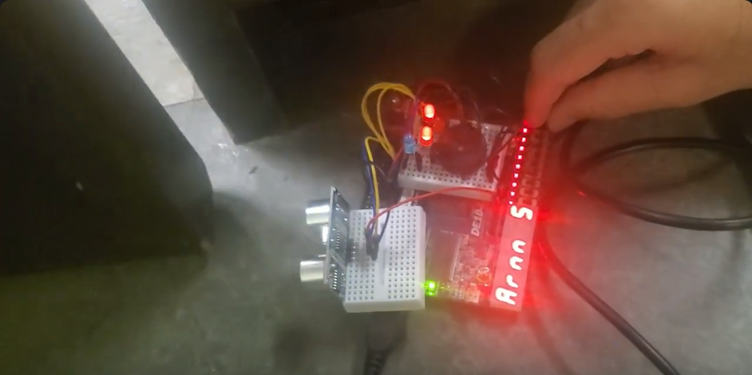

# Home Security System

This project was created for the EECS3201 Digital Systems Design course at York University, Toronto, Canada.

The project aimed to model and develop a home security system, using digital design principles with an FPGA (DE10-Lite), a distance sensor with a peculiar communication
protocol, and other actuators. The system allows the user to set a 4-bit password. When the password is entered correctly through the board's switches, the user is allowed to change the mode
of the system (i.e. armed, unarmed). Suppose the distance sensor measures any movements, and the password is not entered correctly within a certain time. In that case, we use buzzers and LEDs to simulate the system contacting security personnel.

The project was intended for educational and assessment purposes only. The final video demonstration can be found at this link: https://www.youtube.com/watch?v=GGY3ZGjNfwI.

# Video Demo

# Documentation
- The proposal report of the project can be found here [Proposal Report](./EECS3201_proposal_report.pdf) It contains a high-level description of the project and the FSM design states.
- The final report of the project can be found here [Final Report](./EECS3201_final_project_report.pdf). It contains an in-depth explanation of the module design for peripheral drivers, FSMs and overall digital design of the whole system.

## 🛠️ Technologies & Tools

  

- Developed a custom Digital Design for peripheral driver circuits using **Verilog**
- Edited and compiled in **Quartus Prime**

## 🧱 Hardware Platform
- 🔌 **FPGA:** This project uses the [DE10-Lite FPGA development board](https://www.terasic.com.tw/cgi-bin/page/archive.pl?Language=English&CategoryNo=205&No=1046) by [Terasic Technologies](https://www.terasic.com.tw/).
- ⚙️ **Circuit Driver:** Custom circuit driver for all peripherals

## License

